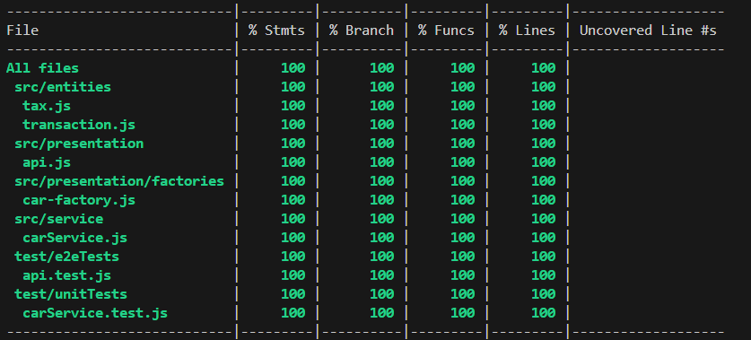

# JSExpert Module 02 - TDD/BDD

This project is part of the **JSExpert** course, specifically Module 02, which focuses on applying concepts of **TDD** (Test-Driven Development) and **BDD** (Behavior-Driven Development). Throughout this module, we explored key testing techniques such as mocks, stubs, spies, end-to-end (e2e) testing, and test coverage.

## Project Overview

The project simulates a **car rental API**, implemented following the principles of TDD and BDD. The database is simulated using JSON files, with data dynamically generated using **Faker.js**. The data is updated every time you run the `npm run seed` command.

### Technologies Used
- **Mocha**: Test framework.
- **Chai**: Assertion library.
- **Sinon**: Mocks, stubs, and spies.
- **Supertest**: HTTP assertions and testing.
- **NYC (Istanbul)**: Code coverage.
- **Faker.js**: Data generation.

## What This Project Does NOT Implement

This project is **entirely focused on testing** (TDD and BDD) and does **not cover** the following areas:  
- Design patterns  
- Clean architecture  
- Error handling  
- Other best practices unrelated to testing  

Its sole purpose is to teach and practice the **foundations of testing**.

## How to Run the Project

1. Clone the repository:
   ```bash
   git clone <repository-url>
   cd <repository-folder>
   ```
2. Run:
    ```bash
    npm install
    npm run seed
    npm run start
    ```

## API Endpoint
### POST/rent
#### Request Body Example:
```bash
{
    "customer": {
        "id": "ccfb9b26-ee16-472f-9784-4ec844672244",
        "name": "Forrest Swaniawski",
        "age": 36
    },
    "carCategory": {
        "id": "c01f4664-8b3a-43d9-bf2b-d20bac09db5b",
        "name": "Minivan",
        "carIds": [
            "292358fe-c475-4626-9342-ee258f95da0e",
            "f2926ad8-8aa2-4e04-aec6-e67eebe467c3",
            "6032081a-eb2d-453d-920e-7a13ee53c8ac"
        ],
        "price": 34.97
    },
    "numberOfDays": 5
}
```
> **Note**: Use data generated by the seed files (carCategory.json, customer.json).

#### Response Example:
```bash
{
    "customer": {
        "id": "ccfb9b26-ee16-472f-9784-4ec844672244",
        "name": "Forrest Swaniawski",
        "age": 36
    },
    "car": {
        "id": "292358fe-c475-4626-9342-ee258f95da0e",
        "name": "Prius",
        "releaseYear": 2024,
        "available": true,
        "gasAvailable": true
    },
    "amount": "R$ 227,31",
    "dueDate": "January 12, 2025"
}
```

## Running Tests
This project includes a robust testing setup, achieving __100% coverage__ 😉.



### Available Test Scripts
- `npm run test:dev` : Runs unit and e2e tests in watch mode.
- `npm run test:e2e` : Runs only e2e tests in watch mode.
- `npm run test:cov` : Runs tests with coverage report.
- `npm test` : Runs unit and e2e tests once.

---

Enjoy exploring the codebase and testing the API! 🚀